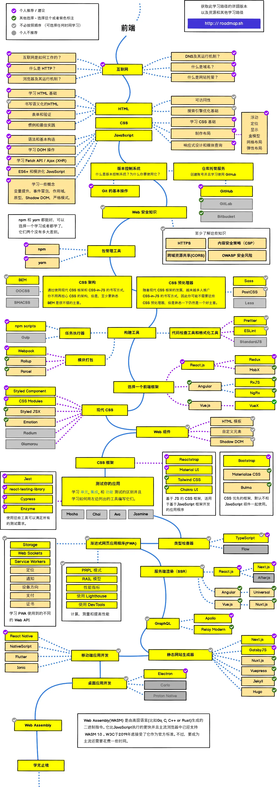

# 前端工程化

前端工程化就是致力于提升工程的开发效率、协作效率、项目质量，贯穿项目设计、开发、测试、上线、维护的整个过程。

主要有四个现代化

1. 模块化：JS 的模块化，css 的模块化，资源的模块化
2. 组件化：复用现有的 UI 结构，样式，行为
3. 规范化：目录结构的划分，代码编译的规范化，接口规范化，文档规范化，Git 分支管理的规范化
4. 自动化：自动化构建，自动化部署，自动化测试

## 优势 ​

### 开发层面

1. 引入了模块化和包的概念，作用域隔离，解决了代码冲突的问题
2. 按需导出和导入机制，让编码过程更容易定位问题
3. 自动化的代码检测流程，有问题的代码在开发过程中就可以被发现
4. 编译打包机制可以让使用开发效率更高的编码方式，比如 Vue 组件、 CSS 的各种预处理器
5. 引入了代码兼容处理的方案（ Babel ），可以让自由使用更先进的 JavaScript 语句，而无需顾忌浏览器兼容性，因为最终会帮转换为浏览器兼容的实现版本
6. 引入了 Tree Shaking 机制，清理没有用到的代码，减少项目构建后的体积

### 团队层面

1. 统一的项目结构 ​
   以前的项目结构比较看写代码的人的喜好，虽然一般在研发部门里都有 “团队规范” 这种东西，但靠自觉性去配合的事情，还是比较难做到统一，特别是项目很赶的时候。
   工程化后的项目结构非常清晰和统一，以 Vue 项目来说基本都有如下目录结构：

- `src` 是源码目录
- `src/main.ts` 是入口文件
- `src/views` 是路由组件目录
- `src/components` 是子组件目录
- `src/router` 是路由目录

2. 统一的代码风格
   写代码时会有诸如字符串用双引号还是单引号，缩进是 Tab 还是空格，如果用空格到底是要 4 个空格还是 2 个空格等一堆 “没有什么实际意义” 、但是不统一的话协作起来又很难受的问题。

3. 可复用的模块和组件
   在前端工程化里，可以抽离成一个开箱即用的 npm 组件包，并且很多包都提供了模块化导出，配合构建工具的 Tree Shaking ，可以抽离用到的代码，没有用到的其他功能都会被抛弃，不会一起发布到生产环境。

4. 代码健壮性有保障
   在开发阶段 TypeScript 编译器就会检查代码是否有问题，而不是之前必须在运行阶段才能发现。

## 工程化的流程 ​

### 工程化的基石 Node.js

Node.js （简称 Node ） 是一个基于 Chrome V8 引擎构建的 JS 运行时环境（ JavaScript Runtime ）。
它让 JavaScript 代码不再局限于网页上，还可以跑在客户端、服务端等场景，极大的推动了前端开发的发展，现代的前端开发几乎都离不开 Node 。

### 构建工具

构建工具可以理解为是 “一套” 工具链、工具集，构建工具通常集 “语言转换 / 编译” 、 “资源解析” 、 “代码分析” 、 “错误检查” 、 “任务队列” 等非常多的功能于一身。
如 “语言转换 / 编译” 就是把代码转换成兼容度更高的低版本 JS 代码，这样我们就能直接使用最新 ES 语法。
除了 “语言转换 / 编译” 这个好处之外，在实际的开发中，构建工具可以更好的提高开发效率、自动化的代码检查、规避上线后的生产风险。

目前已经有很多流行的构建工具，例如： [Vite](https://github.com/vitejs/vite)、 [Webpack](https://github.com/webpack/webpack)、[Grunt](https://github.com/gruntjs/grunt) 、 [Gulp](https://github.com/gulpjs/gulp) 、 [Snowpack](https://github.com/FredKSchott/snowpack) 、 [Parcel](https://github.com/parcel-bundler/parcel) 、 [Rollup](https://github.com/rollup/rollup) … 每一个工具都有自己的特色。

[tooling.report](https://bundlers.tooling.report)

基于 Vue 3 的项目，最主流的工程化组合拳有以下两种：

| 常用方案 | Runtime | 构建工具 | 前端框架 |
| :------: | :-----: | :------: | :------: |
|  方案一  |  Node   | Webpack  |   Vue    |
|  方案二  |  Node   |   Vite   |   Vue    |

方案一是比较传统并且过去项目使用最多的方案组合，但从 2021 年初随着 Vite 2.0 的发布，伴随着更快的开发体验和日渐丰富的社区生态，新项目很多都开始迁移到方案二。

#### Webpack

Webpack 是一个老牌的构建工具，前些年可以说几乎所有的项目都是基于 Webpack 构建的，生态最庞大，各种各样的插件最全面，对旧版本的浏览器支持程度也最全面。

点击访问：[Webpack 官网](https://webpack.js.org)

在开发流程上， Webpack 会先打包，再启动开发服务器，访问开发服务器时，会把打包好的结果直接给过去，下面是 Webpack 使用的 bundler 机制的工作流程。


#### Vite

Vite 的作者也是熟悉的 Vue 作者尤雨溪，它是一个基于 ESM 实现的构建工具，主打更轻、更快的开发体验，主要面向现代浏览器，于 2021 年推出 2.x 版本之后，进入了一个飞速发展的时代，目前市场上的 npm 包基本都对 Vite 做了支持，用来做业务已经没有问题了。

毫秒级的开发服务启动和热重载，对 TypeScript 、 CSS 预处理器等常用开发工具都提供了开箱即用的支持，也兼容海量的 npm 包，如果是先用 Webpack 再用的 Vite ，会很快就喜欢上它！

点击访问：[Vite 官网](https://cn.vitejs.dev)

Vite 是基于浏览器原生的 ES Module ，所以不需要预先打包，而是直接启动开发服务器，请求到对应的模块的时候再进行编译，下面是 Vite 使用的 ESM 机制的工作流程。


可以点击 Vite 官网的这篇文章： [为什么选 Vite](https://cn.vitejs.dev/guide/why.html) 了解更多的技术细节。

## 环境搭建

### 命令行工具

在前端工程化开发过程中，已经离不开各种命令行操作，例如：管理项目依赖、本地服务启动、打包构建，还有拉取代码 / 提交代码这些 Git 操作等等。

`Windows` 系统，可以使用自带的 CMD 或者 Windows PowerShell 工具。

但为了更好的开发体验，推荐使用以下工具（需要下载安装），可以根据自己的喜好选择其一：

|       名称       | 简介                                  |                           下载                            |
| :--------------: | :------------------------------------ | :-------------------------------------------------------: |
| Windows Terminal | 由微软推出的强大且高效的 Windows 终端 | [前往 GitHub 下载](https://github.com/microsoft/terminal) |
|      CMDer       | 一款体验非常好的 Windows 控制台模拟器 |   [前往 GitHub 下载](https://github.com/cmderdev/cmder)   |

`MacOs` 系统，可以直接使用系统自带的 “终端” 工具或 ”[iterm2](https://iterm2.com)“

### Node.js

在 Node.js 官网提供了安装包的下载，不论是使用 Windows 系统还是 MacOS 系统， Node 都提供了对应的安装包，直接下载安装包并运行即可安装到的电脑里，就可以用来开发的项目了。

点击访问：[Node.js 官网下载](https://nodejs.org/zh-cn/download/)

建议使用
[nvm](https://github.com/nvm-sh/nvm)、
[n](https://github.com/tj/n)、
[fnm](https://github.com/Schniz/fnm)
进行版本管理，因为有些项目只能使用特定的 node 版本运行

## 初始化一个项目

如果想让一个项目成为 Node 项目，只需要在命令行 `cd` 到项目所在的目录，执行初始化命令

```bash
npm init
```

### package.json

执行完成项目的根目录下出现了一个名为 `package.json` 的 JSON 文件。

但在实际的项目中，往往需要填写更完善的项目信息，除了手动维护这些信息之外，在安装 npm 包等操作时， Node 也会帮写入数据到这个文件里，来了解一些常用字段的含义：

|     字段名      | 含义                                                                        |
| :-------------: | :-------------------------------------------------------------------------- |
|      name       | 项目名称，如果打算发布成 npm 包，它将作为包的名称                           |
|     version     | 项目版本号，如果打算发布成 npm 包，这个字段是必须的，遵循语义化版本号的要求 |
|   description   | 项目的描述                                                                  |
|    keywords     | 关键词，用于在 npm 网站上进行搜索                                           |
|    homepage     | 项目的官网 URL                                                              |
|      main       | 项目的入口文件                                                              |
|     scripts     | 指定运行脚本的命令缩写，常见的如 `npm run build` 等命令就在这里配置         |
|     author      | 作者信息                                                                    |
|     license     | 许可证信息，可以选择适当的许可证进行开源                                    |
|  dependencies   | 记录当前项目的生产依赖，安装 npm 包时会自动生成                             |
| devDependencies | 记录当前项目的开发依赖，安装 npm 包时会自动生成                             |
|      type       | 配置 Node 对 CJS 和 ESM 的支持                                              |

关于 package.json 的完整的选项可以在 [npm Docs](https://docs.npmjs.com/cli/v8/configuring-npm/package-json/) 上查阅。

### 模块 Module

前端工程化有两个最常用的概念模块（ Module ）和包（ Package ），
模块和包是 Node 开发最重要的组成部分，不管是全部自己实现一个项目，还是依赖各种第三方轮子来协助开发，项目的构成都离不开这两者。

在前端工程的发展过程中，不同时期诞生了很多不同的模块化机制，最为主流的有以下几种：

| 模块化方案 |            全称             |    适用范围     |
| :--------: | :-------------------------: | :-------------: |
|    CJS     |          CommonJS           |     Node 端     |
|    AMD     |   Async Module Definition   |     浏览器      |
|    CMD     |  Common Module Definition   |     浏览器      |
|    UMD     | Universal Module Definition | Node 端和浏览器 |
|    ESM     |          ES Module          | Node 端和浏览器 |

其中 AMD 、CMD 、 UMD 都已经属于偏过去式的模块化方案，在新的业务里，结合各种编译工具，可以直接用最新的 ESM 方案来实现模块化，所以可以在后续有接触的时候再了解。

ESM （ ES Module ） 是 JavaScript 在 ES6（ ECMAScript 2015 ）版本推出的模块化标准，旨在成为浏览器和服务端通用的模块解决方案。

CJS （ CommonJS ） 原本是服务端的模块化标准（设计之初也叫 ServerJS ），是为 JavaScript 设计的用于浏览器之外的一个模块化方案， Node 默认支持了该规范，在 Node 12 之前也只支持 CJS ，但从 Node 12 开始，已经同时支持 ES Module 的使用。

至此，不论是 Node 端还是浏览器端， ES Module 是统一的模块化标准了！

但由于历史原因， CJS 在 Node 端依然是非常主流的模块化写法，所以还是值得进行了解，
CJS 和 ESM 的最基本的区别。

> CJS 使用 `module.exports` 语法导出模块，可以导出任意合法的 JavaScript 类型，例如：字符串、布尔值、对象、数组、函数等等。
> 使用 `require` 导入模块，在导入的时候，当文件扩展名是 `.js` 时，可以只写文件名，而此时使用的是 `.cjs` 扩展名，所以需要完整的书写。

> ESM 使用 `export default` （默认导出）和 `export` （命名导出）这两个语法导出模块，和 CJS 一样， ESM 也可以导出任意合法的 JavaScript 类型，例如：字符串、布尔值、对象、数组、函数等等。
> 使用 `import ... from ...` 导入模块，在导入的时候，如果文件扩展名是 `.js` 则可以省略文件名后缀，否则需要把扩展名也完整写出来。

cjs 模块是运行时加载，esm 是编译时加载, 是静态导入，因此，可在编译期进行 Tree Shaking，减少 js 体积

### 包 Package

包可以简单理解为模块的集合，一个包可以只提供一个模块的功能，也可以作为多个模块的集合集中管理
包通常是发布在官方的包管理平台 [npmjs](https://www.npmjs.com/package/package) 上面，开发者需要使用的时候，可以通过包管理器安装到项目里，并在的代码里引入，开箱即用，使用包可以减少在项目中重复造轮子，提高项目的开发效率。

包管理器（ Package Manager ）是用来管理依赖包的工具，比如：发布、安装、更新、卸载等等。

Node 默认提供了一个包管理器 npm ，在安装 Node.js 的时候，默认会一起安装 npm 包管理器，可以通过以下命令查看它是否正常。

```bash
npm -v
```

常用包管理器 [npm](https://www.npmjs.com)、[yarn](https://yarnpkg.com)、[pnpm](https://pnpm.io)

| npm 命令                              | yarn 命令                     | pnpm 命令                     | 功能描述                         |
| :------------------------------------ | :---------------------------- | :---------------------------- | :------------------------------- |
| npm install                           | yarn (install)                | pnpm install                  | 根据 package.json 安装所有依赖   |
| npm install (--save/-S) [package]     | yarn add [package]            | pnpm add [package]            | 添加依赖包至 dependencies        |
| npm install [--save-dev/-D] [package] | yarn add [--dev/-D] [package] | pnpm add [--dev/-D] [package] | 添加依赖包至 devDependencies     |
| npm install [--global/-g]             | yarn global add               | pnpm add -g                   | 全局安装依赖包                   |
| npm uninstall [package]               | yarn remove [package]         | pnpm remove [package]         | 移除依赖包                       |
| npm update                            | yarn upgrade                  | pnpm upgrade                  | 升级依赖包                       |
| npm init                              | yarn init                     | pnpm init                     | 互动式创建 package.json 文件     |
| npm run                               | yarn                          | pnpm run                      | 运行 package.json 中预定义的脚本 |

node_modules 是 Node 项目下用于存放已安装的依赖包的目录

## Npm Script

NPM 脚本是 package.json 中定义的一组内置脚本和自定义脚本

好处，NPM 中所有依赖的 `node_modules bin` 都可以在脚本中直接访问

执行多个脚本 `npm run lint && npm test`

“pre”执行前运行脚本 和 “post” 执行后运行脚本

您可能需要向脚本传递一些参数。 您可以使用命令末尾的 -- 来实现这一点。 添加到脚本中的任何 -- 都会被转换成一个带有 npm 配置前缀的环境变量(配置参数使用`npm_config_`前缀放入环境中)

```
npm run test1 --test=demo
```

## 模块依赖

依赖常用有两种

- dependencies 指定了项目运行所依赖的模块
- devDependencies 指定项目开发所需要的模块，如语法转换、开发服务器、语法检查、vue 的编译器等仅在开发阶段用到

安装`dependencies`

```
# 以 axios（客户端/服务端请求工具） 为例
# 通过 npm 安装
$ npm install --save axios

# 通过 yarn 安装
$ yarn add axios
```

安装`devDependencies`

```
# 以 typescript (解析 ts/tsx 文件的工具) 为例
# 通过 npm 安装
$ npm install --save-dev typescript

# 通过 yarn 安装
$ yarn add -D typescript
```

版本说明：

> 指定版本： 比如 1.2.2，遵循大版本.次要版本.小版本的格式规定，安装时只安装指定版本。

> 波浪号+指定版本： 比如~1.2.2，表示安装 1.2.x 的最新版本（不低于 1.2.2），但是不安装 1.3.x，也就是说安装时不改变大版本号和次要版本号。

> 插入号+指定版本： 比如 ˆ1.2.2，表示安装 1.x.x 的最新版本（不低于 1.2.2），但是不安装 2.x.x

一般默认都是插入号，所以可能会有依赖更新导致兼容问题（npm 包发布原则：相同大版本号下的新版本应该兼容旧版本，有些开发者没有严格遵守）
npm 的`package-lock.json`或 yarn 的`yarn.lock`为信息实际的版本号，
安装依赖时请查看*lock*文件是否改变，是否会影响项目

## Babel

Babel 是一个 JavaScript 编译器，它可以让开发者仅需维护一份简单的 JSON 配置文件，即可调动一系列工具链将源代码编译为目标浏览器指定版本所支持的语法

`browserslist` 用特定的语句来查询浏览器列表
它是现代前端工程化不可或缺的工具，无论是处理 JS 的 babel，还是处理 CSS 的 postcss，凡是与垫片相关的，他们背后都有 browserslist 的身影。

`core-js` 它是 JavaScript 标准库的 polyfill（垫片/补丁）, 新功能的 es'api'转换为大部分现代浏览器都可以支持
运行的一个'api' 补丁包集合。

## TypeScript

TypeScript 简称 TS ，既是一门新语言，也是 JS 的一个超集，它是在 JavaScript 的基础上增加了一套类型系统，它支持所有的 JS 语句，为工程化开发而生，最终在编译的时候去掉类型和特有的语法，生成 JS 代码。

[`tsconfig.json`配置项](https://www.typescriptlang.org/tsconfig)

## 代码规范

- Eslint -- 专注于 JavaScript 代码质量检查
- Prettier -- 专注于检查并自动更正代码风格
- EditorConfig -- 专注于统一编辑器编码风格配置
- stylelint 规范你的 css
- husky 是一个 Git hooks 工具
- lint-staged 是一个对 git 暂存区代码运行已配置的 linter（或其他）任务

vue 的风格指南
[Vue 前端开发团队风格指南](https://zhuanlan.zhihu.com/p/627992357)

## 知识图谱

- [ECMAScript](https://www.processon.com/view/link/60a320615653bb3d82dc8e0d)
- [Typescript 基础知识](https://www.processon.com/view/link/5fc8b9d4e0b34d4f98cf2049)
- [Typescript 工程篇](https://www.processon.com/view/link/5fc5ebb8e0b34d1856d6695a)
- [前端学习路线](https://objtube.gitee.io/front-end-roadmap/#/)

## 资料

- [vite](https://cn.vitejs.dev/guide/)
- [vue](https://cn.vuejs.org)

- [typescript](https://www.typescriptlang.org/zh/docs/)
- [eslint](https://eslint.org/docs/latest/)
- [stylelint](https://stylelint.io)
- [prettier](https://prettier.io/docs/en/index.html)
- [sass](https://www.sass.hk/docs/)

代码提交 git 时统一规范

- [lint-staged](https://github.com/okonet/lint-staged)
- [husky](https://github.com/typicode/husky)

开发

- [Vue Router 路由](https://router.vuejs.org/zh/guide/)
- [Pinia 状态管理](https://pinia.web3doc.top)
- [axios http 请求](http://axios-js.com)
- [dayjs 日期格式化](https://dayjs.gitee.io/zh-CN/)
- [mitt 全局事件监听](https://github.com/developit/mitt)
- [Nuxt.js 服务端渲染](https://www.nuxtjs.cn)
- [Lodash- 实用工具库](https://lodash.com/)


